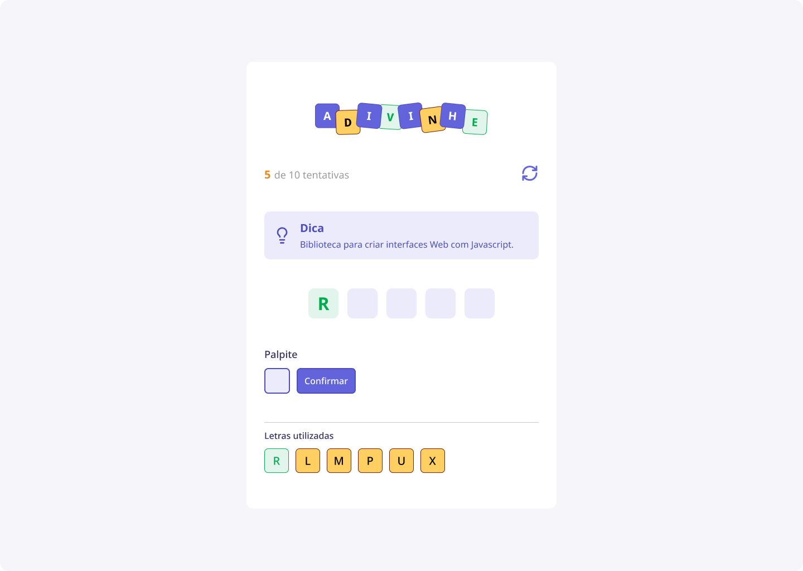

<h1 align="center">Jogo de Adivinhação</h1>

O projeto é  um jogo Web para adivinhar palavras com o objetivo de aplicar e consolidar os fundamentos de React.

  <a href="#-tecnologias">Tecnologias</a>&nbsp;&nbsp;&nbsp;|&nbsp;&nbsp;&nbsp;
  <a href="#-projeto">Projeto</a>&nbsp;&nbsp;&nbsp;|&nbsp;&nbsp;&nbsp;
  <a href="#memo-licença">Licença</a>

  

 

  

## 🚀 Tecnologias

Esse projeto foi desenvolvido com as seguintes tecnologias:

- React

## Projeto

Esse projeto é para praticar habilidades usando React.
